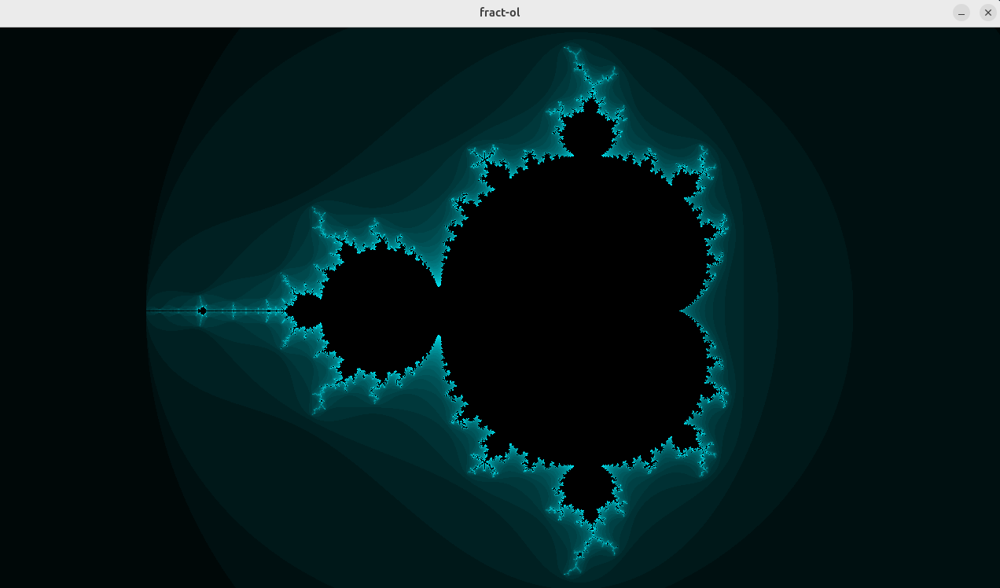
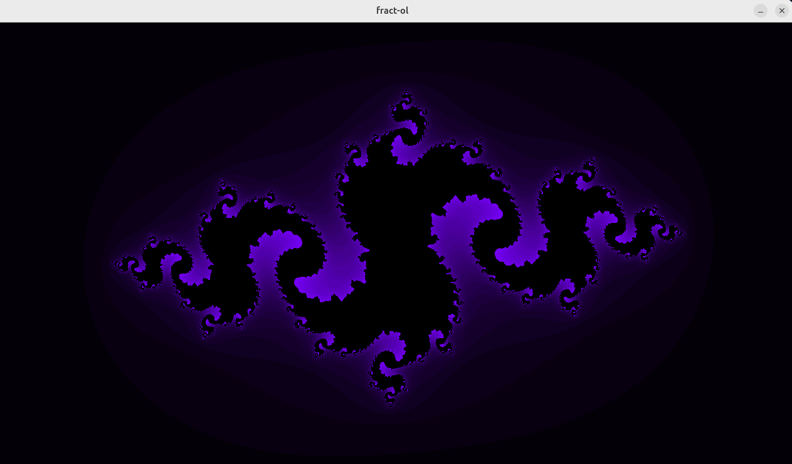

# **fract-ol**
A fractal rendering application for generating stunning fractal images and animations. Created with MiniLibX, a graphical API for C as a 42 Common Core project.

## Features

- Support for popular fractal types: Mandelbrot, Julia & Multibrot
- Zoom functionality for mouse scroll button for detail exploration
- Image movement with arrow keys

## Getting started

Ensure you have these prerequisites:

- A Linux or macOS operating system (check macOS branch).
- `gcc` (GNU Compiler Collection).
- **MiniLibX** library (install manually: https://harm-smits.github.io/42docs/libs/minilibx).
- `make` utility.

## Setup
1. Clone the repository:

   ```bash
   git clone https://github.com/bobbyskywalker/fract-ol

2. Download MiniLibX, and copy the library's directory (minilibx-linux) into *lib* directory in the project.

3. Get back to the project's root and run:

```bash
make
```

## Usage

You can run the program with various parameters.

For the Mandelbrot set:
```bash
./fractol mandelbrot
```
For the Julia sets:
```bash
./fractol julia <an integer ranging from 1 to 3>
```
For the Multibrot set:
```bash
./fractol multibrot <an integer (best range: 1-12)>
```
#### Controls
* Zoom in and zoom out with **mouse wheel**
* Move the image with **arrow keys**
* **Space** for color shifting
* Exit with **esc**

## Preview:
### Mandelbrot Set


### Julia Set


## Notes 📌
👀 If you notice any bugs, feel free to submit a pull request!

📢 If you're a 42 student, use this as a guide at most. Don't cheat, learn! <3

📅 Created in January 2025 as part of 42's Common Core at 42 Warsaw